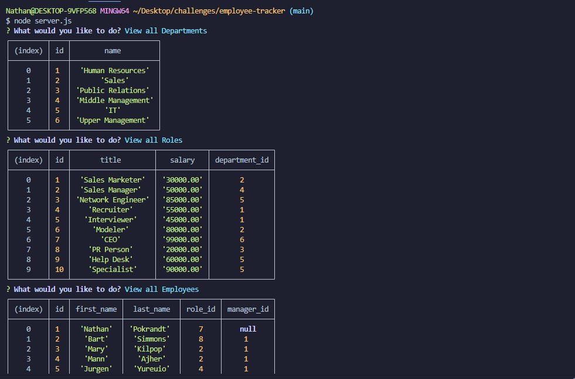
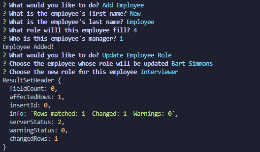

# employee-tracker
A CLI to help manage a company's employee database

## Description

Welcome to the employee tracker management system, a CLI that uses a SQL database to track employees, as well as the roles and departments of the company. Each of these tables can be viewed or added to, in addition to being able to modify employee's role as it changes.

## Usage

Upon running node server.js to start the program, there will be eight options available, including "exit", which just exits the program. Three of these options will suggest to display one of the tables (departments, roles, employees). Selecting any of those will show the selected table formatted as a table in the CLI. 

Each table has an add method. For departments that would just be the department name, which is requested and should be less than 30 characters in length. For roles the user will be queried for the role's title, the salary as a seven-digit number with two decimal places, and the id of the department the role falls under. For employees the user will be queried for the employee's first and last name, plus the id of the role they fit and the id of their manager, if applicable. 

Finally, if the option to update the employee's role is selected, the user will be shown a list of all the employees to select from. The user will select the employee whose role will be changed, then be presented with all the roles. Selecting the role the employee is moving to will update the employee's role id in the table.

## Link

As this is a CLI program, it is not deployed anywhere. Instead, watch a video demo here:
https://www.loom.com/share/020e3a6d0744429081b84672f5344e7b?sid=268e9791-f392-47d1-8c2f-aef4289b29fe

## Credits

All of this code is my own, plus stuff used from the boot camp and W3schools
